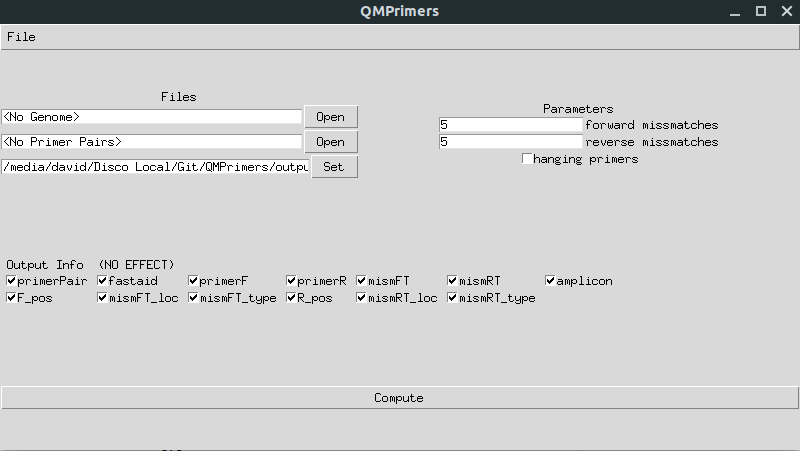

# QMPrimers
A tool to select the best primers to perform quantitative metabarcoding studies. It aims to be used by all kind of users as it comes with a graphical interface.

**WARNING:** This program is still in development, so expect bugs and crashes. Its use is still not recommended!

### Dependencies

- [Biopython](https://biopython.org)
- [Numpy](http://www.numpy.org)
- [Pandas](https://pandas.pydata.org)

### Brief tutorial

This programm has a command line mode and a GUI mode:

* Command line mode:
  ```bash
  python3.7 QMPrimers --nogui <other required parameters>
  
  #Use --help to print a brief manual 
  python3.7 QMPrimers --help
  ```

* GUI mode:
  ```bash
  python3.7 QMPrimers <no options>
  ```
  

  * The **primer pairs file** must have the following header. The order does not matter:                        id;forwardPrimer;fPDNA;reversePrimer;rPDNA;ampliconMinLength;ampiconMaxLength
  * The **output** entry is used to specify the path and name of the output file**s**. The program outputs a template csv file and a text file containing basic statistics.
  * The **precomputed template** entry is used to load a previous output file in order to bypass the computing. It's possible to load a template created by another program, but, obviously, the same format must be followed. The program doesn't need all the output info to restore the template. When opened the Parameters section becomes hidden.
  * **Hanging primers**: mf = forward maximum missmatches, mr = reverse max. miss. 
    Primer pairs are allowed to match between [0-mf,len(genome)+mr] instead of just between the length of the genome
  * **Check integrity** is used to check if the genome file is correctly formated. The primer pairs file is always checked due to the fact that is expected to be a small file.
  * **Nend miss.** outputs the number of missmatches in the N first and end nucleotides of the F  and R primer respectively.


